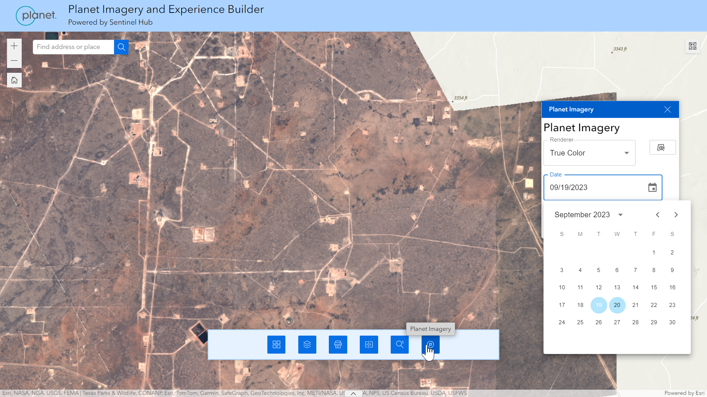

# Planet Experience Builder Demo Widget

This is a sample Experience build widget that shows how to integrate imagery from Planet APIs with ArcGIS.

This widget is powered by the [Sentinel Hub](https://sentinel-hub.com/) APIs and requires that you have both a Planet and Sentinel Hub account.  

It allows for a user to search for and visualize imagery stored in a Sentinel Hub collection directly from within ArcGIS Experience Builder so that Planet imagery can be used in GIS workflows without needing to download any data.

## How does it work?

- Select from different imagery renderers - users can select from different layers that determine how imagery is rendered. Layers are defined in Sentinel Hub Configurations.
- See what dates imagery is available for - a calendar can be used to search for dates that can be selected to display on the map
- Stream imagery as OGC services - this code sample uses the Sentinel Hub OGC API to stream the map services in this widget from the Sentinel Hub cloud-based APIs

Below is a screenshot of what the widget looks like when used in Experience Builder.

## Set up instructions

1. Install and set up the [ArcGIS Experience Builder SDK](https://developers.arcgis.com/experience-builder/).
2. Clone the sample repo and copy this widget's folder (within widgets) to the client/your-extensions/widgets folder of your Experience Builder installation. ([see documentation for more details](https://developers.arcgis.com/experience-builder/guide/getting-started-widget/)).
3. Go to your [Sentinel Hub dashboard](https://apps.sentinel-hub.com/dashboard/#/) and create an OAuth client.  Add the client ID and client secret to the widget `config.json` file.
4. Create a Sentinel Hub collection and [populate it with data](https://docs.sentinel-hub.com/api/latest/api/data-import/).  Also create a configuration with the appropriate layers for different band combinations or indices.
5. Please refer to Esri documentation for deploying widgets, such as to ArcGIS Enterprise by following these instructions  on [deploying widgets in ArcGIS Enterprise](https://doc.arcgis.com/en/experience-builder/11.0/configure-widgets/add-custom-widgets.htm).

## Security Considerations

This widget utilizes Sentinel Hub OAuth credentials embedded within the web application.  Users of the application will be able to see these credentials, so only deploy this application to trusted users and not publicly.

Consider the following as options to improve the security of this workflow

- Configure allowed origins for the OAuth credentials in the Sentinel Hub dashboard and use a dedicated Sentinel Hub account for the end application.
- Use with an application that is secured to your organizations' intranet and/or includes a user authentication step.
-  Deploy a secured back-end service/API wrapper or a reverse proxy to sit in between your application and Sentinel Hub APIs to remove the possibility of leaking credentials.

## Issues
Find a bug or want to request a new feature? Please let us know by submitting an issue. You can also [reach out directly to Planet](https://www.planet.com/contact/) or your Customer Success Manager.

## Licensing and Use
Copyright 2024 Planet

Licensed under the Apache License, Version 2.0 (the "License");
you may not use this file except in compliance with the License.
You may obtain a copy of the License at

   http://www.apache.org/licenses/LICENSE-2.0

This is provided as-is and is intended to be a code sample and not an officially supported Planet product, however the APIs that power this are supported.
