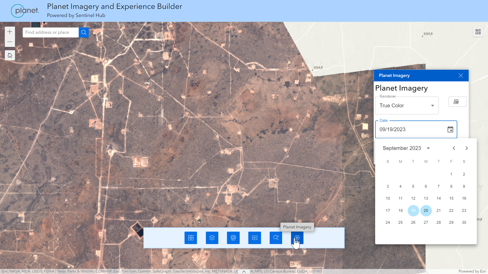
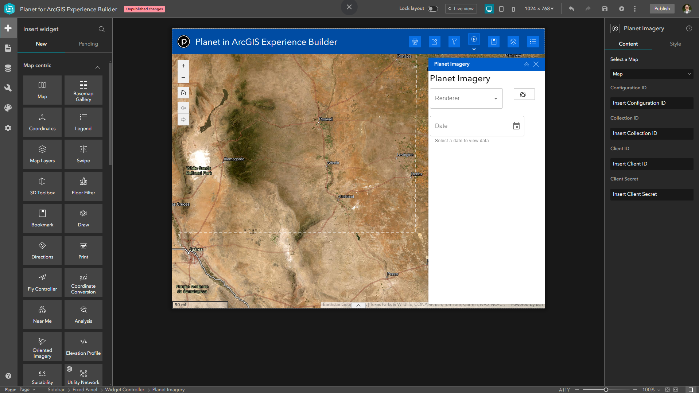

# Planet for ArcGIS Experience Builder Widget

Browse and visualize [Planet](https://planet.com) imagery from within ArcGIS Experience Builder.

- Search for imagery stored in Sentinel Hub Collections using the map extent and calendar. Uses the Sentinel Hub Catalog API based on STAC.
- Visualize imagery on the map by selecting from different layers as defined in Sentinel Hub Configurations. Uses the Sentinel Hub OGC API to stream WMTS services.

### Example application using the widget



## Setup Instructions

Below are setup instructions that go through the following:

1. Development Environment
2. Widget Configuration
3. Deployment

### 1. Development Environment

Install and set up the [ArcGIS Experience Builder SDK](https://developers.arcgis.com/experience-builder/guide/install-guide/).

In the client install step, before running `npm ci`, you must add additional dependencies to the `package.json` file. To do this, navigate to the `client` folder and open `package.json`. Find the `dependencies` block and add the following dependencies: 
```
"@mui/material": "5.15.15", "@mui/x-date-pickers": "7.3.1", "@date-io/date-fns": "^2.14.0", "date-fns": "^2.28.0",
```
Clone this repo and copy the contents of the widget folder (i.e. the `planet-imagery` folder within `experience-builder-planet-widget-exbVersion1.14`) to the `client/your-extensions/widgets` folder of your Experience Builder installation. 

For more info, [see Esri documentation for more details on getting started with widgets.](https://developers.arcgis.com/experience-builder/guide/getting-started-widget/)

### 2. Widget Configration

Once your development environment is set up for ArcGIS Experience Builder and the widget is loaded, open the Experience Builder application and create a new application.

Add a map to the canvas and also add a *Widget Controller*.  Add the *Planet Imagery* widget to the *Widget Controller*. Select the widget to configure it.



Select a map from your Experience.  This map is where imagery will be added to in the widget.

Then you will need to enter a few details from Planet: a `Configuration ID`, a `Collection ID`, a `Client ID`, and a `Client Secret`.

For the `Client ID` and `Client Secret`, you can go to your [Sentinel Hub dashboard](https://apps.sentinel-hub.com/dashboard/#/) and create an OAuth client. Ensure you specify allowed origins for the server where the app will be hosted and for your localhost development environment.

Create a Sentinel Hub collection and [populate it with data](https://docs.sentinel-hub.com/api/latest/api/data-import/).  Also create a configuration with the appropriate layers for different band combinations or indices.  Add the `Collection ID` and `Configuration ID` to the settings side panel.

### 3. Deployment

Please refer to Esri documentation for deploying widgets and application you build:
- [Automated deployments](https://developers.arcgis.com/experience-builder/guide/deployment-topics/#automated-deployments)
- [Downloading from Developer Edition](https://developers.arcgis.com/experience-builder/guide/deployment-topics/#download-the-experience)
- [Deploying widgets in ArcGIS Enterprise](https://doc.arcgis.com/en/experience-builder/11.0/configure-widgets/add-custom-widgets.htm)

## Security

This widget utilizes Sentinel Hub OAuth credentials embedded within a Single Page Application. Users of the application will be able to see these credentials. Consider the following to mitigate risks of users accessing these credentials.

- Ensure you limite allowed origins in the set up step and don't allow all origins.
- Only deploy this application to trusted users on secure networks, not publicly.
- Monitor usage of your credentials for possible leaks.
- Use a reverse proxy if you need to obfuscate the Sentinel Hub APIs or use your own auth.
- Create a dedicated Sentinel Hub account for the sole purpose of powering these apps.

## Notes and Limitations
Find a bug or want to request a new feature? Please let us know by submitting an issue.

### Known Issues
- Widget should not be opened prior to the associated map loading. Ensure widget is enclosed in a contained like a *Widget Controller* so that it can be opend after map loads.
- Widget has not been tested with ArcGIS Enterprise

### Version Compatibility

The widget has been tested with ArcGIS Experience Builder version 1.14 with ArcGIS Online and ArcGIS Experience Builder version 1.10 with ArcGIS Online.

There are two separate folders for versions that are compatible with ArcGIS Experience Builder 1.10 and 1.14 - use the version compatible with your ArcGIS environment.

See [release versions](https://developers.arcgis.com/experience-builder/guide/release-versions/) for more details on compatible versions.

### Disclaimer
This is provided as-is and is intended to be a code sample and not an official product. The APIs used in this widget are officially supported, though.

## License
Copyright 2024 Planet

Licensed under the Apache License, Version 2.0 (the "License");
you may not use this file except in compliance with the License.
You may obtain a copy of the License at

   http://www.apache.org/licenses/LICENSE-2.0

